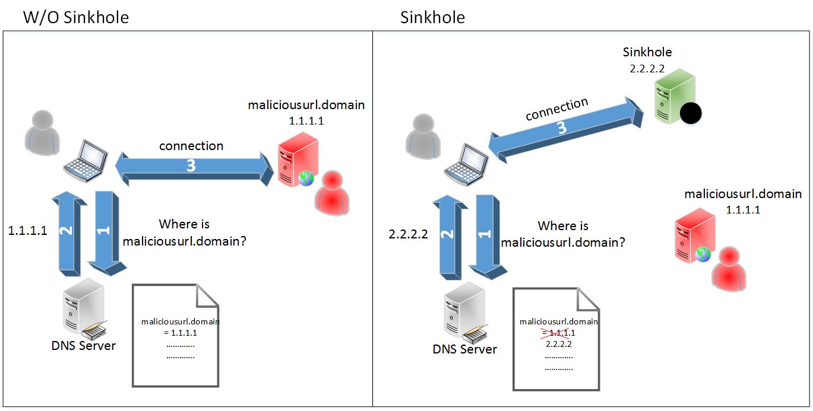
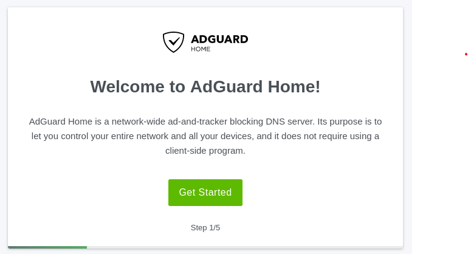
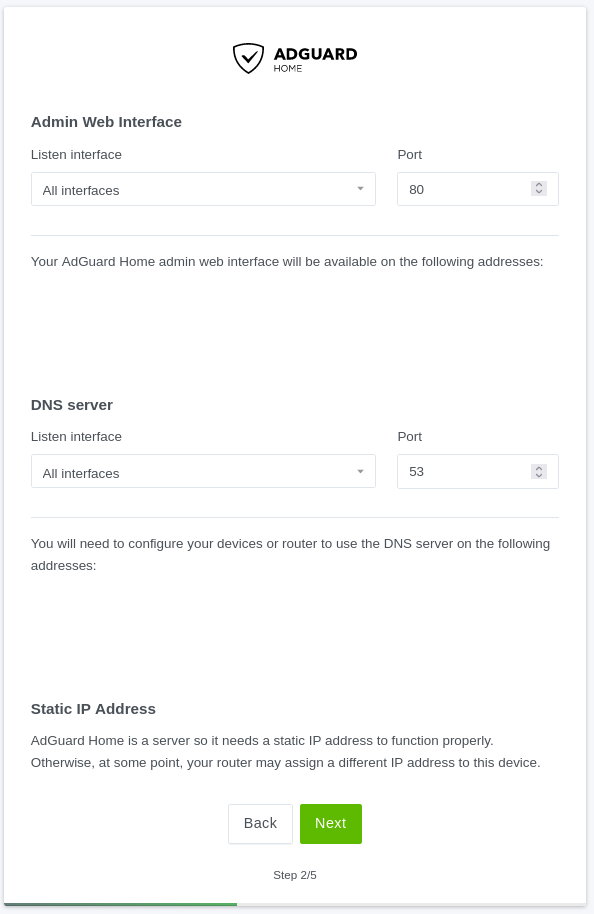

# AdGuard Home - Der bessere AdBlocker

```csharp
if (readDocuments.ContainsAll({
    "Einleitungsdokument",
    "RaspberryPi"
})) {
    continue;
} else {
    return;
}
```

## Inhaltsverzeichnis
1. [Was ist AdGuard Home  und Unterschiede zu klassischen AdBlockern](#was-ist-adguard-home-und-unterschiede-zu-klassischen-adblockern)
2. [Funktionsweise](#funktionsweise)
3. [Einschränkungen](#einschränkungen)
4. [Disclaimer](#disclaimer)
5. [Installation von AdGuard Home](#installation-von-adguard-home)
6. [Weiterführende Quellen](#weiterführende-quellen)


## Was ist AdGuard Home und Unterschiede zu klassischen AdBlockern
AdGuard Home ist eine Software, die im gesamten Netzwerk Werbung und Tracking blockiert. Tracking ist eine Praxis, bei der deine Aktivitäten im Internet verfolgt und analysiert werden. Oft machen das Werbeunternehmen, um ein Profil deiner Interessen und Gewohnheiten zu erstellen und dir gezielte Werbung zu liefern.  
Nachdem du AdGuard Home eingerichtet hast, deckt es alle deine Geräte zuhause ab und du musst keine clientseitige Software mehr installieren. Somit sind auch Geräte wie zum Beispiel Smart-TVs oder IoT-Geräte geschützt.  

Clientseitige Software sind Programme, die auf deinem Endgerät installiert sind. Serverseitige Anwendungen laufen hingegen auf dem Server.

## Funktionsweise
AdGuard Home funktioniert als DNS-Server in deinem Netzwerk. DNS steht für Domain Name System und ist im Grunde das Telefonbuch des Internets. Wenn du eine Website besuchst, fragt dein Gerät einen DNS-Server nach der IP-Adresse, die zu dem Domainnamen der Website gehört.

AdGuard Home hat eine Liste von Domains (die sog. Blocklist), die mit Werbung und Tracking verbunden sind. Wenn ein Gerät in deinem Netzwerk versucht, eine solche Domain zu erreichen, blockiert AdGuard Home die Anfrage indem es anstelle der korrekten IP-Adresse die eines Sinkhole-Servers zurückgibt und somit die Anfrage im Leeren verläuft und die Werbung oder das Tracking-Script nicht geladen wird.

Ein Sinkhole-Server, auch als DNS-Sinkhole oder Internet-Sinkhole bekannt, dient dazu, den Netzwerkverkehr umzuleiten oder zu blockieren. Dies wird oft für Sicherheitszwecke verwendet, kann aber auch zum Blockieren von unerwünschter Werbung oder Tracking verwendet werden.  



Zusätzlich zu Werbungslisten kann listen mit allen möglichen Seiten einfügen, die dann geblockt werden. Möchte man einzelne Ausnahmen einrichten kann man sie auf der sog. "Allowlist" eintragen.


## Einschränkungen
Eine Einschränkung ist, dass AdGuard Home zwar Werbung und Tracking in allen Anwendungen blockieren kann, aber nicht in der Lage ist, sogenannte "native" Werbung zu blockieren. Das sind Werbeanzeigen, die direkt in den Inhalt einer Website oder App integriert sind und nicht von einem separaten Server geladen werden. Da diese Werbung auf die gleiche Weise wie der restliche Inhalt ausgeliefert wird, kann AdGuard Home sie nicht blockieren.

Ein gutes Beispiel für native Werbung ist Instagram. Auf Instagram sind Werbeposts oft nicht von regulären Posts zu unterscheiden und werden nicht von einem separaten Server geladen, sodass sie nicht durch die üblichen Methoden der Werbeblockierung gestoppt werden können. Die gleiche Limitierung trifft auf YouTube zu.

Des Weiteren  kann AdGuard Home zwar den gesamten Netzwerkverkehr überwachen und filtern, hat aber keinen Einfluss auf den Datenverkehr, der außerhalb des Netzwerks stattfindet. Das bedeutet, dass Werbung und Tracking auf Geräten, wie etwa deinem Smartphone, nicht mehr verhindert werden können, sobald keine Verbindung mehr zum Netzwerk mit dem AdGuard-Server besteht. Dies trifft beispielsweise beim Wechsel vom WLAN auf mobile Daten zu.

Zu beachten ist auch, dass durch das Blockieren von Inhalten manche Websites unbenutzbar werden, da u. U. Funktionen blockiert werden, die von der Seite benötigt werden. Deshalb sollte man am Anfang vorsichtig sein, welche Blocklisten man hinzufügt.


## Installation von AdGuard Home
Die einfachste Methode AdGuard Home zu installieren ist die Verwendung von deinem [Raspberry Pi](<../Raspberry Pi/>). Um zu vermeiden, dass du vorausgegangene Projekte verlierst, kannst du diese Installation einfach auf einer neuen Micro-SD Karte vornehmen und so zwischen mehreren Projekten wechseln. Alternativ besteht auch die Möglichkeit mit Containern zu arbeiten. Darauf wird aber erst in einer weiterführenden Anleitung eingegangen.  

### Voraussetzungen
1. Installiere Raspberry OS 64bit auf deinem Pi (Option für SSH aktivieren).
2. Verbinde den Raspberry Pi mit dem Heimnetzwerk, damit dieser eine IP-Adresse erhält.
3. Gib deinem Raspberry Pi eine statische IP-Adresse:
    - Klicke [hier](https://avm.de/service/wissensdatenbank/dok/FRITZ-Box-7590/201_Netzwerkgerat-immer-die-gleiche-IP-Adresse-von-FRITZ-Box-zuweisen-lassen/#:~:text=Benutzeroberfl%C3%A4che%20der%20FRITZ!-,Klicken%20Sie%20im%20Men%C3%BC%20%22Heimnetz%22%20auf%20%22Netzwerk%22.,gleiche%20IPv4%2DAdresse%20zuweisen%22.) um das Vorgehen mit einer Fritzbox zu erfahren
    - Für abweichende Router kannst du in deren Dokumentation nachschlagen

### Installation des Programms
Leider gibt es für AdGuard Home kein APT-Paket, weshalb wir es manuell installieren müssen.
Mit den folgenden Befehlen kannst du dir die ausführbaren Dateien herunterladen:
```
wget 'https://static.adguard.com/adguardhome/release/AdGuardHome_linux_armv6.tar.gz'
tar -f AdGuardHome_linux_armv6.tar.gz -x -v
cd AdGuardHome
```
Der Befehl `sudo ./AdGuardHome -s install` installiert den Service auf deinem Rechner. Beachte, dass `./AdGuardHome` die Datei ist, die du mit dem Befehl ausführst.
Neben dem Installationsbefehl gibt es noch weitere, die nützlich sein können:
- `sudo ./AdGuardHome -s uninstall`: Deinstalliert AdGuard Home
- `sudo ./AdGuardHome -s start`: Startet den Service
- `sudo ./AdGuardHome -s stop`: Beendet den Service
- `sudo ./AdGuardHome -s restart`: Kombination aus stop und start
- `sudo ./AdGuardHome -s status`: Gibt den aktuell Status des Services aus

### Konfiguration
Im aktuellen Zustand ist AdGuard Home zwar installiert, aber um zu funktionieren, muss der Service zunächst konfiguriert werden.
AdGuard hat im Hintergrund einen Webserver gestartet, der eine Konfigurationsseite bereitstellt. Gib hierfür einfach `https://localhost:3000` in die Adresszeile deines Browsers ein. Befindest du dich auf einem anderen PC, dann gibst du statt `localhost` die IP-Adresse des Pis ein.



Auf der folgenden Seite brauchst du keine Einstellungen zu ändern. Es kann kann aber interessant sein, sich die Informationen, die zu sehen sind, einmal durchzulesen.



Im Anschluss musst du einen Admin-User festlegen, mit dem du dich später auf dem Dashboard anmelden kannst.

Auf den restlichen Seiten brauchst du nichts mehr einzustellen. 
Die letzte Seite leitet dich auf das Dashboard weiter. Sie läuft auf Port 80.

Nun musst du noch, wie auf der Konfigurationsseite 4 beschrieben, die DNS-Einstellungen deines Rechners ändern, damit AdGuard Home Werbung blockieren kann.

## Disclaimer
Um AdGuard Home verwenden zu können, musst du die DNS-Einstellungen deiner Geräte ändern. Es wird empfohlen, diese Änderung zu Testzwecken nicht am Heimrouter vorzunehmen, sondern zunächst an den eigenen Geräten. Das Ändern der IP-Adresse des DNS-Servers im Heimrouter kann zu Netzwerkproblemen führen und die Internetverbindung für alle Geräte im Netzwerk beeinträchtigen.  
Daher sollte eine solche Änderung nur mit Zustimmung aller Mitbewohner und/oder Eltern (falls du noch zuhause wohnst) vorgenommen werden. Bitte beachte, dass du für alle Folgen, die aus der Änderung der IP-Adresse des DNS-Servers resultieren, selbst verantwortlich bist.

## Weiterführende Quellen

### Offizielle Dokumentation
Um weiteres über AdGuard Home zu erfahren, kannst du dir die offizielle [Dokumentation des Entwicklers](https://github.com/AdguardTeam/AdGuardHome#getting-started) ansehen.


### Umfassenderer Vergleich von AdBlock zu anderen AdBlockern 
Klicke [hier](https://adguard.com/en/blog/adguard-vs-adaway-dns66.html), um zu einem genaueren Vergleich zwischen AdGuard Home und traditionellen AdBlockern zu gelangen.
